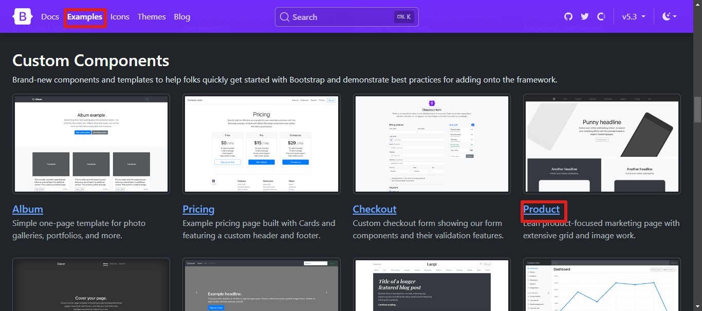

# ChatRoom using the PHP and Jquery


## Steps to be Followed
* `Step 1:` Go to the <a href="https://getbootstrap.com/">Bootstrap</a> and Then go to Example section to choose the template
<a href="https://getbootstrap.com/docs/5.3/examples/product/">myTemplate</a>

<br>

* `Step 2:` Go to view page source and copy everything
<a href="view-source:https://getbootstrap.com/docs/5.3/examples/product/">Click to Copy</a> and create afile as `(index.php)` and paste the template that you copied.

Then Copy the style sheet (product.css) <a href="https://getbootstrap.com/docs/5.3/examples/product/product.css">Click to copy</a>

* `Step 3:` Then find the div which has the class name as `(.col-md-6 p-lg-5 mx-auto my-5)` Change  content according to you.
```
<form action="./claim.php" method="post" style="display: flex;justify-content: center; align-items: center;gap: 12px; flex-direction:column">
        <span style="font-weight: bold; color:green">MyChat.com</span>
        <input type="text" autocomplete="off" name="room" style="color:red;">
        <button type="submit" class="btn btn-outline-success">Claim Room</button>
</form>
```

* `Step 4:` create a file `(claim.php)` for testing the use cases like the room name should be unique in the database and does not contain special symbols etc.
### Database Connectivity code for Xampp and mysql
```
<?php  
// Script to connect to the database
$servername = "localhost";
$username = "root";
$password = "";
$database = "chatroom";
$conn = mysqli_connect($servername, $username, $password, $database);
if(!$conn){
    die("Failed to connect".mysqli_connect_error($conn));
}
?>
```

* `Step 5:`This file has the code to check the use case and insert into the dadatbase and also pas the  `$room=$_POST['room']` to the next file `(room.php)`. 

```
`<?php  

$room=$_POST['room'];

if(strlen($room)>20){
    $message="Please choose a name between 2 to 20";
    echo '<script language="javascript"> ';
    echo 'alert("'.$message.'");';
    echo 'window.location="http://localhost/PHP%20Projects/Chatroom%20using%20Php%20and%20Jquery/"';
    echo '</script>';
}
else if(!ctype_alnum($room)){
    $message="Please choose a  alpha numeric room name";
   echo '<script language="javascript"> ';
   echo 'alert("'.$message.'");';
   echo 'window.location="http://localhost/PHP%20Projects/Chatroom%20using%20Php%20and%20Jquery/"';
   echo '</script>';
}
else{
    //connect to the database
    include '_dbconnect.php';
}
//Check if the room exist
$sql="select * from rooms where roomname= '$room'";
$result=mysqli_query($conn,$sql);
if($result){
    if(mysqli_num_rows($result)>0){
             //The mysqli_num_rows() function returns the number of rows in a result set.
    $message="Please choose a different name, this name is already exist";
    echo '<script language="javascript"> ';
    echo 'alert("'.$message.'");';
    echo 'window.location="http://localhost/PHP%20Projects/Chatroom%20using%20Php%20and%20Jquery/"';
    echo '</script>';

    }
    else{
        $sql="INSERT INTO `rooms` ( `roomname`, `stime`) VALUES ( '$room', current_timestamp()); ";
        if(mysqli_query($conn,$sql)){
            $message="Your room is ready and you can chat now";
            echo '<script language="javascript"> ';
            echo 'alert("'.$message.'");';
            echo 'window.location="http://localhost/PHP%20Projects/Chatroom%20using%20Php%20and%20Jquery/room.php?roomname='.$room.'"';
            echo '</script>';

        }
    }

}
?>
```

* `Step 6:` Then create a file and name as `(room.php)` then use any social media template. For template resource use <a href="https://www.bootdey.com/snippets/view/chat-app"> Go to the template</a>

* `Step 7:` In that fle you can customize like adding img ,date and time 
```
<!-- for date and time -->
<?php date_default_timezone_set("Asia/Kolkata");
echo "The time is " . date("h:ia");
?>
```

* `Step 8:`  Thne create input tag and button for getting the input and storing in database search the class name as `input-group-prepend` and paste the input and button tag

```
<div class="input-group-prepend">
    <input type="text" class="form-control" name="usrmsg" id="usrmsg" placeholder="Enter text here...">
    <button class="btn btn-primary" name="submitmsg" id="submitmsg"><i class="fa fa-send"></i></button>
</div>
```
* `Step 9:` Then add the Jquery syntax for post request <a href="https://www.w3schools.com/jquery/ajax_post.asp">Go to Link </a>

```
$("button").click(function(){
  $.post("demo_test.asp", function(data, status){
    alert("Data: " + data + "\nStatus: " + status);
  });
});
```

### Modifiy it
```
$("#submitmsg").click(function() {
var clientmsg=$("#usermsg").val();
 $.post("postmsg.php", {text: clientmsg,room: '<?php echo $roomname ?>',ip: '<?php echo $_SERVER['REMOTE_ADDR'] ?>'},

function(data, status) {
    document.getElementsByClassName('anyClass')[0].innerHTML = data;});
return false;

 });
```
### Note: dont forget to add the jquery cdn:
<a href="https://releases.jquery.com/">Go to the Link</a> and copy the minified version 

```<script src="https://code.jquery.com/jquery-3.7.1.min.js" integrity="sha256-/JqT3SQfawRcv/BIHPThkBvs0OEvtFFmqPF/lYI/Cxo=" crossorigin="anonymous"></script>```

* `Step 10:` Then create the file and name as `(postmsg.php)`and write the insert query.

```
<?php  
 //connect to the database
 include '_dbconnect.php';

 $msg=$_POST['text'];
 $room=$_POST['room'];
 $ip=$_POST['ip'];
 $sql="INSERT INTO `msg` ( `msg`, `room`, `ip`, `stime`) VALUES ( '$msg', '$room', '$ip', current_timestamp());";
mysqli_query($conn,$sql);
mysqli_close($conn);

?>
```

* `Step 11:` Then try to insert using the input tag and check whether the msg is inserted or not.

* `Step 12:` Then Trigger Button on Enter

```
var input = document.getElementById("myInput");
input.addEventListener("keypress", function(event) {
    <!-- enter key  code is 13 -->
  if (event.key === "Enter") {
    event.preventDefault();
    document.getElementById("submitmsg").click();
  }
});
```

* `Step 13:` Then modify the previous jquery code to erase the input msg after the button is clicked

### Modifiy it
```
$("#submitmsg").click(function() {
var clientmsg=$("#usermsg").val();
 $.post("postmsg.php", {text: clientmsg,room: '<?php echo $roomname ?>',ip: '<?php echo $_SERVER['REMOTE_ADDR'] ?>'},

function(data, status) {
    document.getElementsByClassName('anyClass')[0].innerHTML = data;});
     $("#usrmsg").val("");
return false;

 });
```
* `Step 14:`  To check the new message every 1 second
```
 setInterval(runFunction, 1000);
        function runFunction() {
            $.post("htcont.php", {
                    room: '<?php echo $roomname ?>'
                },
                function(data, status) {
                    document.getElementsByClassName('anyClass')[0].innerHTML = data;
                })
        }

```

* `Step 15:` Then create a file as `(htcont.php)` and add the jquery

```
<?php
//connect to the database
include '_dbconnect.php';
$room = $_POST['room'];
$sql = "select msg,stime,ip from msg where room='$room'";

$html_content= "";
$result = mysqli_query($conn, $sql);
if (mysqli_num_rows($result) > 0) {
    while ($row = mysqli_fetch_assoc($result)) {
        $html_content= $html_content. '<li class="clearfix">
        <div class="message-data text-right">
            <span class="message-data-time">
                <?php
                date_default_timezone_set("Asia/Kolkata");
                echo date("h:i A") . ", Today" ?>
            </span>
            
        </div>';
        $html_content= $html_content. ' <div class="message other-message float-right msg" style="margin:5px">' . $row['msg'] . ' 
        </div>
    </li>';
    }
}
echo $res;
```
* `Step 15:` <span Style="color:green;Font-weight:bold"> Project Completed ! </span>


